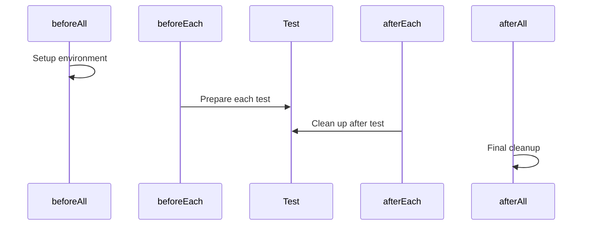
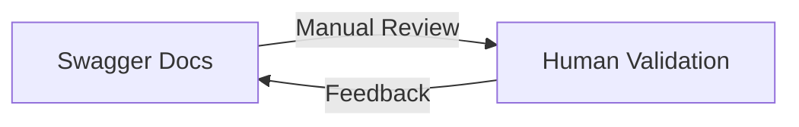
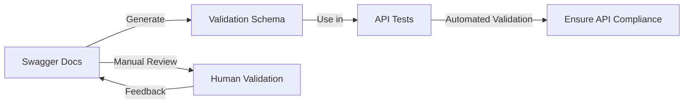

# API Testing with Playwright

Ghislain Gabriëlse & Lars de Bruijn

<!-- Ghislain -->
---
layout: presenter
presenterImage: "ghislain.jpg"
hideInToc: true
---

# Ghislain Gabriëlse

Test Automation Consultant <a  href="https://detesters.nl/">DeTesters</a>

- Woerden, Netherlands 🇳🇱
- 36 years
- Father of 2 minions
- Butler to a cat
- ~12 years of experience
- Builds Tools that simplify complex tasks

<!-- This is a **note** -->

---
layout: presenter
presenterImage: "lars.jpeg"
hideInToc: true
---

# Lars de Bruijn

Test Automation Consultant <a  href="https://techchamps.io/">TechChamps</a>

- Alblasserdam, Netherlands 🇳🇱
- Father of 7 guitars & 1 motorcycle
- ~3 years of experience
- Primary focus on Test Automation with a love for Ops side of things and Cyber Security

<!-- Lars -->
---
hideInToc: true
layout: full
layoutClass: gap-16
---
# Agenda
<Toc text-sm minDepth="1" maxDepth="1" />

<!-- Lars-->

---
layout: center
---

"API testing is a process that confirms an API is working as expected. There are several types of API tests, and each one plays a distinct role in ensuring that the API's functionality, security, and performance remain reliable."

<!-- Lars -->
---
layout: full
---
# Why Playwright for API Testing?

- 🔗 **Unified Framework**: Playwright allows you to perform both UI and API testing within a single framework, reducing the need for multiple tools and simplifying the testing process.
- 🛠️ **Extensible**: Playwright is highly extensible, allowing you to integrate with other tools and libraries to enhance your testing capabilities.

Note; As with many tool choices, it heavily depends on the context of your organisation. 

<!-- Ghislain-->

---
layout: default
---
# Flow overview


<!-- Ghislain -->
---
layout: full
---
# API Testing

<div style="display: flex; justify-content: center; gap: 20px; align-items: center;">
  
</div>

- Define the method + the endpoint
- Perform Assertions on HTTP Response Codes
- Perform Assertions on Response Headers
- Perform Assertions on Response Body

<!-- Lars-->

---
layout: full
---
## GET Requests
- A GET request is used to retrieve data from a server.
- It is read-only and does not modify data.

📤 Client sends a GET request → 🌐 Server processes → 📥 Server returns data (JSON/XML)

```ts twoslash
import { test, expect } from '@playwright/test';

test('GET /products - validate product response', async ({ request }) => {
  const response = await request.get('/products');
  expect(response.status()).toBe(200);
  const jsonResponse = await response.json();
  expect(jsonResponse.products.length).toBeGreaterThan(0);
});
```

<!-- Ghislain -->

---
layout: full
---
## POST Requests
- A POST request is used to send data to a server to create a resource.
- Unlike GET, it modifies data on the server.

📤 Client sends a POST request with data → 🌐 Server processes → 📥 Server responds with confirmation or new resource

```ts twoslash
import { test, expect } from '@playwright/test';

test('POST /products/add - validate product creation', async ({ request }) => {
    const response = await request.post('/products/add', { 
      data: { 
        title: 'BMW'
      }
    });

    expect(response.status()).toBe(201);

    const jsonResponse = await response.json();
    expect(jsonResponse).toHaveProperty('id');
    expect(jsonResponse.title).toBe('BMW');
});
```
<!-- Lars -->
---
layout: default
---
## DELETE Requests
- A DELETE request is used to remove a resource from the server.

📤 Client sends a DELETE request → 🌐 Server removes the resource → 📥 Server responds with confirmation (e.g., 204 No Content)

```ts twoslash
import { test, expect } from '@playwright/test';

test('DELETE /products/1 - delete a product', async ({ request }) => {
  const response = await request.delete('/products/1');
  expect(response.status()).toBe(200);

  const jsonResponse = await response.json();
  expect(jsonResponse).toHaveProperty('isDeleted', true);
});
```
<!-- Lars -->
---
layout: default
---
# Request Headers & Authorization
- Headers provide metadata about the request or response.
- Authorization headers help verify user identity and secure API access.

📤 Client sends a request with headers → 🌐 Server validates & processes → 📥 Server responds with data or an error

```ts twoslash
import { test, expect } from '@playwright/test';

const token: string = 'Bearer_Token';

test('GET /user - with Authorization header', async ({ request }) => {
  const response = await request.get('/user', {
    headers: {
      'Authorization': `Bearer ${token}`,
      'Content-Type': 'application/json',
      'Accept': 'application/json'
    }
  });
  expect(response.status()).toBe(200);
});
```

<!-- Lars -->
---
layout: default
---
## Assignment time!

- Go to https://github.com/Ghislain89/booker-platform
- Clone the project, run `npm install` and `npm run setup` to get started.
- Start with assignment1.spec.ts in the playwright/tests/api folder.
- Carefully read the docs and README to understand the logic of the specific endpoints. When in doubt: Ask 😉

<div style="display: flex; justify-content: center; gap: 20px; align-items: center; margin-top: 50px;">
  
  
</div>


<!-- Ghislain -->
---
layout: default
---
# Query & Path Parameters
- Query parameters are used to filter, sort, or modify data in API requests.
- They are appended to the URL after a ? and separated by &.
- Path Params are usually used to fetch specific resourcesd (e.g. by Id.)

📤 Client sends a GET request with query parameters → 🌐 Server processes filters → 📥 Server returns filtered data

```ts twoslash
import { test, expect } from '@playwright/test';

const id = 1;

test('GET /products - retrieve sorted products using params', async ({ request }) => {
  const response = await request.get(`/products/${id}`, {
    params: {
      order: 'asc',
      category: 'electronics',
    },
  });
  const jsonResponse = await response.json();

  // Assertions to check the ordering and category etc.
});
```
<!-- Ghislain -->

---
layout: default
---
## Assignment time!

- Continue with assignment2.spec.ts in the playwright/tests/api folder.
- Carefully read the docs and README to understand the logic of the specific endpoints. When in doubt: Ask 😉

<div style="display: flex; justify-content: center; gap: 20px; align-items: center; margin-top: 50px;">
  
  
</div>
<!-- Ghislain -->

---
layout: default
---
# Scaling - Schema Validation


- You could manually validate if the response matches the docs, but this is cumbersome.
- Let's look at a better way!


---
layout: default
---
# Scaling - Schema Validation



- Implement schema validation for requests and responses
- Based on the OpenAPI spec, generate Zod Schema's to use as validation in tests.
- Add an expectation in the test that the responseBody equals the generated schema.
- Contract testing 'lite'

---
Layout: default
---
- Create helpers and fixtures for commonly used actions
- Create Data Factories to create request bodies & manage test data.

Try and find a balance between DRY and KISS. These concepts _can, and probably will_ bite one another.


<!-- Ghislain -->
---
layout: default
---
# Thank you!

- Questions/feedback?
- Playwright API documentation: https://playwright.dev/docs/api-testing
<!-- Ghislain -->