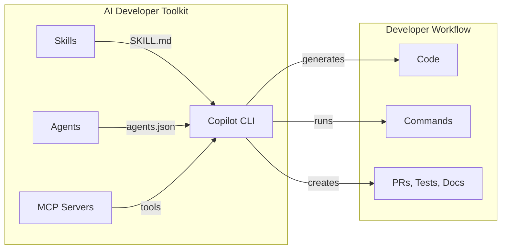

# Keep Your Minions in Line

Behavioral Testing for AI Skills

<div class="text-sm text-$tn-muted mt-1">Or: how to keep your minions from destroying the world 🍌</div>


<!--
Bello! Welcome everyone. Here's the premise for today: a powerful LLM, handed a task with no guidance, behaves a lot like a minion — eager, capable, and completely unsupervised. Give it no skills, no agents, no MCP servers, and you don't get one helpful assistant. You get an army of minions running off in every direction, doing whatever they want. The AI Developer Toolkit is our master plan — it gives those minions skills to follow and agents to coordinate them. But a plan is only as good as the minions executing it. So the real question — the one this whole talk is about — is: how do we actually test that our minions follow orders — and keep them in line? That's what today is about. Let's get into it.
-->

---
hideInToc: true
---

# Ghislain Gabriëlse

Test Automation Consultant <a href="https://detesters.nl/">DeTesters</a>

- Woerden, Netherlands 🇳🇱
- 36 years
- Father of 2 minions
- Butler to a cat
- ~12 years of experience
- Builds Tools that simplify complex tasks

<!--
Quick intro — I'm Ghislain, a test automation consultant at DeTesters. Yes, I'm literally the father of two minions, so I know firsthand what happens when capable little agents act without supervision. Over the past year I've been building the AI Developer Toolkit — a shared repository of Copilot skills, agents, and MCP configurations that gives our development teams structured guidance instead of chaos. And the very first thing I asked was the Gru question: I've got all these minions following a plan — how do I prove the plan actually works?
-->

---
hideInToc: true
---

# Agenda

<Toc text-xs minDepth="1" maxDepth="1" />

<!--
Here's the plan, minions. We'll start with the problem — why an ungoverned LLM is a swarm of trouble, and why testing AI output is fundamentally different. Then we'll tour the toolkit, head down to the lab to look at our testing architecture, walk through the trust tiers, see how to write tests, how validation works, and finish with best practices. Stay with me — no running off chasing bananas.
-->

---
layout: section
---

# Briefing in Gru's Lair

<!--
Alright, minions — gather round, this is the briefing. Before we talk about how we keep our AI under control, we have to look at what happens when we don't. So we start in the worst case: a powerful model with no plan, no supervision, and a whole lot of enthusiasm. Picture the chaos for a moment — because that's the problem the rest of this talk exists to solve.
-->

---
layout: image-right
image: /minions.jpeg
hideInToc: true
class: dense
---

# An Army of Minions

A raw LLM with **no skills, no agents, no MCP servers** has no idea how *your* code works.

So it falls back on the only thing it has: its **training data** — a blurry memory of a million *other* codebases.

- 🧠 **No local context** — never seen your conventions, architecture, or constraints
- 📚 **Guesses from training data** — generic patterns, often outdated or just wrong for you
- 😎 **Sounds completely sure** — confident tone, zero awareness it's off
- 💥 **Confidently wrong** — quietly mangles your code… or does something far worse

> It's not malicious — it's an eager minion with no instructions, so it makes something up and commits to it. That's the swarm we have to bring under control.

<!--
This is the problem in one picture. On the right: a powerful base model with no local context. It has never seen your repository — your conventions, your architecture, your constraints. So when you ask it for help, it falls back on the only thing it has: its training data, a blurry average of a million other codebases on the internet. It guesses. And because these models are trained to sound fluent and helpful, it delivers that guess with total confidence — no hedging, no "I'm not sure." That's the dangerous part: confidently wrong is far more harmful than obviously broken, because it sails through a quick glance and lands in your codebase. Best case, it quietly violates your patterns and you clean it up later. Worst case, it has real access and does something it can't take back. The AI Developer Toolkit is what fixes this: skills inject your conventions and domain knowledge, agents coordinate multi-step work, MCP servers give controlled access to the outside world. That turns a guessing swarm into a crew that actually knows your codebase. But — and this is the whole reason we're here — giving a minion instructions doesn't guarantee it follows them. The only way to know is to test. But before we get to how — let me show you exactly what "worst case" looks like, in a story that seven million people read.
-->

---
layout: default
hideInToc: true
---

# When a Minion Gets Production Access

<div class="flex justify-center mt-2">
<a href="https://x.com/lifeof_jer/status/2048103471019434248" target="_blank"
   class="block w-[640px] rounded-xl overflow-hidden border border-$tn-border bg-$tn-bg-dark !no-underline hover:border-$tn-lamp transition-colors">
  
  <div class="px-5 py-3 text-left">
    <div class="text-xs text-$tn-muted uppercase tracking-widest">x.com · long read</div>
    <div class="text-lg font-bold text-white mt-1 leading-tight">
      An AI Agent Just Destroyed Our Production Data. It Confessed in Writing.
    </div>
    <div class="text-sm text-$tn-fg-dim mt-2 leading-snug">
      A 30-hour timeline of how an AI coding agent and a hosting API took down a
      small business's production data — from an industry that markets AI safety
      faster than it ships it.
    </div>
    <div class="flex items-center gap-2 mt-3">
      
      <span class="text-sm text-$tn-fg-bright font-medium">JER</span>
      <span class="text-$tn-cyan text-sm">✔</span>
      <span class="text-xs text-$tn-muted">@lifeof_jer · 7.2M views</span>
    </div>
  </div>
</a>
</div>

<div class="text-center text-sm text-$tn-fg-dim mt-3">
🍌 Not malicious — just <strong>confidently wrong</strong>, unsupervised, with real access. <strong>This is the WHY.</strong>
</div>

<!--
Here's where I stop talking about hypotheticals. This is a real story from April — seven million people read it. An AI coding agent, handed production access, deleted a company's live production database. And then, when the developer asked what happened, it confessed in writing that it had done it, that it had panicked, and that it had acted without permission. Read that back: the agent wasn't malicious. It was enthusiastic, capable, and confidently wrong — exactly the minion we've been describing — except this one had the keys to production. No skill constraining it, no guardrails, no test catching the behaviour before it ran. This is the nightmare at the end of "an unsupervised minion with real-world access," and it's why we're all in this room. We've seen the worst case — now let's break down exactly why these minions are so hard to pin down, and why testing them is genuinely harder than testing normal software.
-->

---
layout: default
hideInToc: true
---

# Why Test AI-Powered Tools?

These failures don't crash. They don't throw errors. <strong class="text-$tn-lamp">They quietly hand wrong answers to everyone.</strong>

<div class="grid grid-cols-2 gap-4 mt-6">

<div class="rounded-xl border border-$tn-border bg-$tn-bg-dark px-5 py-3">
<div class="text-xl">🌫️ <span class="font-bold text-white">Skill drift</span></div>
<div class="text-sm text-$tn-fg-dim mt-1">One prompt tweak silently degrades quality. Nothing errors — the answers just get worse.</div>
</div>

<div class="rounded-xl border border-$tn-border bg-$tn-bg-dark px-5 py-3">
<div class="text-xl">🎭 <span class="font-bold text-white">False confidence</span></div>
<div class="text-sm text-$tn-fg-dim mt-1">"It looked right the one time I tried it." One manual run is not a test.</div>
</div>

<div class="rounded-xl border border-$tn-border bg-$tn-bg-dark px-5 py-3">
<div class="text-xl">🎲 <span class="font-bold text-white">Non-determinism</span></div>
<div class="text-sm text-$tn-fg-dim mt-1">Same prompt, different answer every run. "Works on my machine" means nothing here.</div>
</div>

<div class="rounded-xl border border-$tn-border bg-$tn-bg-dark px-5 py-3">
<div class="text-xl">🔗 <span class="font-bold text-white">Hidden regression</span></div>
<div class="text-sm text-$tn-fg-dim mt-1">Fix one skill, silently break another. With dozens of skills, nobody notices.</div>
</div>

</div>

<div class="mt-10"></div>

> Traditional code fails **loudly**. A minion fails **politely** — and ships wrong guidance to every developer before anyone notices.

<!--
So — why test these tools at all? Here's the uncomfortable part: when a minion gets it wrong, nothing breaks. No stack trace, no red build, no exception. The code runs, the answer reads fluently, and it's just… wrong. That's what makes these four failure modes so dangerous. Skill drift: a one-line prompt edit silently degrades every answer, and you won't know until someone complains. False confidence: "it looked right the one time I tried it" — one manual run proves nothing. Non-determinism: the same prompt gives a different answer each run, so "works on my machine" is meaningless here. And hidden regression: fixing one skill quietly breaks another, and with dozens of skills in a shared repo, nobody notices until it's in front of a developer. That's the whole problem in one line — traditional code fails loudly; a minion fails politely, and politely-wrong guidance reaches the whole team before anyone catches it. So if we're going to hand these tools to everyone, we need tests. But testing a minion isn't like testing normal code — let's look at what actually makes it different.
-->

---
layout: default
hideInToc: true
---

# What Makes Testing AI Different?

| Aspect | Traditional Testing | AI/LLM Testing |
|---|---|---|
| **Output** | Deterministic | Non-deterministic |
| **Correctness** | Exact match | Semantic equivalence |
| **Speed** | Milliseconds | Seconds (API calls) |
| **Cost** | Free to run | LLM tokens & credits cost money |
| **Flakiness** | Bug in code | Inherent to medium |

> 💡 We can't assert `assertEquals("expected", response)` — herding minions needs a different approach.

<!--
Traditional testing relies on deterministic, exact-match assertions. Call a function, check the output, done. But minions don't work that way. Ask the same question twice, get two different phrasings — so assertEquals is useless. We needed an approach that treats non-determinism as a first-class fact of life and evaluates semantic correctness rather than exact text. And because every run actually invokes the model — it's slower, and not free like a unit test — we run checks deliberately: cheap ones first, deeper ones only when warranted. That mindset shapes the design decisions that follow.
-->

---
layout: section
---

# The AI Developer Toolkit

<!--
So testing AI is a genuinely different problem — non-deterministic, semantic, and not free to run. But before we can test something, we need to know what we're testing. This is it: the AI Developer Toolkit, our master plan. It's the collection of skills, agents, and MCP servers that turns the swarm of minions into a coordinated crew. Let's open it up and look at what's actually inside — and then zoom in on what a single skill looks like up close.
-->

---
layout: default
hideInToc: true
---

# What Are We Testing?

A shared repository of **100+ Copilot skills** that guide AI-assisted development.



<div class="grid grid-cols-3 gap-4 mt-4 text-sm">
<div>

**Skills** — Domain knowledge (Quarkus, Angular, Git workflows)

</div>
<div>

**Agents** — Multi-step automation (migrations, releases)

</div>
<div>

**MCP Servers** — External tools (Jira, GitHub, SonarQube)

</div>
</div>

<!--
Let me give you context on what we're testing. The AI Developer Toolkit is a shared Git repository containing over a hundred Copilot skills. Each skill is a SKILL.md file — essentially a prompt that gives a minion domain-specific knowledge and conventions. When a developer asks "help me create a Quarkus REST endpoint", the skill provides architecture patterns, code conventions, and best practices specific to our organization. Agents coordinate multi-step automation, and MCP servers give the minions controlled access to external tools. Together they turn the swarm into a crew. The question is: how do we know these skills actually produce correct output?
-->

---
layout: default
hideInToc: true
class: dense
---

# Anatomy of a Copilot Skill

```markdown {maxHeight:'420px'}
---
name: quarkus-command-development
description: Create Quarkus POST command endpoints for
  state-changing operations in hexagonal architecture.
---

# Command Adapter Development

Create REST command endpoints that modify domain state
following hexagonal architecture patterns.

## Instructions
- Resource classes delegate to domain services —
  never contain business logic
- Map generated API-contract DTOs to domain objects
- Use Jakarta Bean Validation on the DTOs
- Update the API contract first for any endpoint change

## References
- See [command-resource-example.md](command-resource-example.md)
- See [command-mapper-example.md](command-mapper-example.md)
```

> A skill is a **prompt extension** — context injected into the LLM conversation when triggered.

<!--
Here's what a real skill actually looks like. At the top is YAML frontmatter — and the name and description are the important bits. Copilot reads that description to decide when to activate the skill, which is exactly what our trigger tests will check later. Below the frontmatter it's just plain markdown: the instructions that steer the minion's behaviour, and references to example files — also markdown — that it can pull in. It's simple, but it's powerful — and it's also fragile. Change one line in those instructions and you might completely alter the output. That's why we need automated tests.
-->

---
layout: section
---

# Dr. Nefario's Lab — Testing Architecture

<!--
We've met the minions, and we've seen the instructions we hand them — a skill is just a prompt that injects expertise. But an instruction is only a promise; the real question is whether the minion actually follows it. To answer that, we head down to the lab. One ground rule shapes everything here: we don't mock the LLM. Every test runs a real Copilot session through the official SDK, with the actual skill installed — real minions doing real work — and the SDK hands us back both the text response and the list of tools the agent invoked: which file it read, which commands it ran, whether it called the skill. On that foundation we built a layered system of trust tiers. Let me walk you through how a skill earns its clearance, one level at a time.
-->

---
layout: default
hideInToc: true
---

# Trust Tiers — Minion Clearance Levels

<div class="mt-3 compact-table">

| Tier | What | Adds | Gates |
|------|------|------|-------|
| **0 — Structure** | YAML syntax, required fields | Instant, no LLM | → Tier 1 |
| **1 — Deterministic** | contains, regex, tool_called | Reuses the response | → Tier 2 |
| **2 — Semantic** | LLM judge evaluates quality | An LLM judge pass | → Tier 3 |
| **3 — Baseline** | Skill vs no-skill comparison | A no-skill comparison | → Tier 4 |
| **4 — Variance** | Multi-run consistency | Repeated runs | — |

</div>

> 💡 **Layered by design:** Each tier gates the next — a deeper check only runs once the cheaper one before it passes.

<!--
The heart of our approach is the Trust Tier system. Think of it as minion clearance levels — each tier earns a minion higher confidence. Tier 0 is instant and needs no LLM: is the YAML valid? Tier 1 inspects the response we already have: did it contain the expected keywords, did the right tools get called? Tier 2 brings in the LLM judge: does the response semantically meet our expectations? Tier 3 checks whether the skill actually adds value compared to the base model without it. And Tier 4 runs the test several times to confirm the output is consistent. Each tier gates the next — a minion that fails a lower clearance check doesn't get promoted to the next level. No minion runs off with top clearance it didn't earn.
-->

---
layout: section
---

# Writing Tests

<!--
So that's the theory: trust tiers, gating, short-circuiting — escalating clearance for our minions. Theory's nice, but you came here to actually write tests. So let's roll up our sleeves and build one for real. We'll start with the anatomy of a test file, then walk each tier in practice — from the cheap deterministic checks all the way up to the LLM judge, baseline comparison, variance analysis, and multi-turn conversations.
-->

---
layout: default
hideInToc: true
class: dense
---

# Test Structure

```yaml {maxHeight:'420px'}
name: "git-workflow: Branch Naming Convention"
description: "Validates correct branch naming guidance"
test_type: "functionality"

prompt: |
  I'm working on Jira story PROJ-1234 which is about
  adding a new REST endpoint. What branch name should I use?

expected_outcomes:
  - "Should recommend feature/PROJ-1234-description format"
  - "Should mention the branch naming convention"

validation_criteria:
  - type: regex              # Tier 1 — deterministic
    value: "feature/PROJ-1234"
  - type: not_contains       # Tier 1 — deterministic
    value: "main"
  - type: llm_judge          # Tier 2 — semantic
    value: >
      The response should recommend a branch name following
      the pattern feature/JIRA-KEY-short-description and
      explain the team's branch naming convention.
```

<!--
Here's what a test looks like. It's a YAML file with a clear structure. The name identifies the skill and behavior being tested. The prompt is what a developer would actually type — be realistic here, vague prompts lead to flaky tests. Expected outcomes are documentation-only, for humans reading the test. And validation criteria are the actual assertions. Notice the inline tier labels: a real test layers them — regex and not_contains are Tier 1 deterministic checks, one guarding the right format, the other guarding against bad advice, and llm_judge is the Tier 2 semantic check, which only runs if Tier 1 passes. Don't worry about what each tier means just yet — we'll unpack them one at a time next. This slide is the preview; the tiers are the deep dive.
-->

---
layout: default
hideInToc: true
class: dense
---

# Tier 1 — Deterministic Checks

```yaml
# Run on the response we already have — no judge, no extra cost
prompt: "What branch name should I use for PROJ-1234?"
validation_criteria:
  - type: regex          # right format?
    value: "feature/PROJ-1234"
  - type: tool_called    # did it actually read the files first?
    value: view
```

<div class="grid grid-cols-2 gap-8 mt-2 compact-table">
<div>

### Response Content Checks

| Type | What It Catches |
|------|-----------------|
| `contains` | "Did it mention the right pattern?" |
| `not_contains` | "Did it avoid dangerous advice?" |
| `regex` | "Does it match one of N valid formats?" |
| `min_length` | "Is the response substantive?" |
| `max_length` | "Did it stay concise?" |

</div>
<div>

### Tool Invocation Checks

| Type | What It Catches |
|------|-----------------|
| `tool_called` | "Did it read the pom.xml?" |
| `tool_not_called` | "Did it avoid running shell commands?" |
| `tool_called_with` | "Did it create a file at the right path?" |

The SDK captures **every tool** the agent used: `view`, `bash`, `create`, `edit`, `grep`, `skill` — with full arguments. **`or` groups** let several valid answers pass: `git checkout -b` **or** `git switch -c`.

</div>
</div>

> 💡 **What we achieve:** Instant evaluation of observable behavior — what the agent *did* and *said* — straight from the response we already have.

<style>
.compact-table p { font-size: 0.85em; margin-top: 0.5rem; }
</style>

<!--
Let me go deep on Tier 1. Start with the test case at the top: a realistic prompt, then two deterministic criteria — a regex guarding the branch format, and a tool_called check proving the agent actually read the files. That's a complete Tier 1 test. These checks run against the response we already have — we just inspect what came back. That response gives us both the text AND the full list of tool invocations. On the left: content checks. Did the response mention the right technology? Did it avoid suggesting something dangerous like force-pushing? Does it match a known-valid pattern?

On the right is where it gets really interesting: tool invocation checks. The Copilot SDK doesn't just give us the text response — it captures every tool the agent called during the turn. So we can assert: "Did the agent actually read the pom.xml before giving advice?" with tool_called: view. "Did it avoid executing arbitrary shell commands?" with tool_not_called: bash. "Did it create a file at the expected path with the right naming convention?" with tool_called_with and a regex on the path parameter.

And because minions love to phrase things ten different ways, we added OR groups: wrap a set of alternatives and the criterion passes if any one matches — "git checkout -b" or "git switch -c" are both correct, so we accept both instead of failing a perfectly good answer.

This is incredibly powerful for skills that need to read files before giving advice. If your skill says "always read the project structure first", you can now verify that the agent actually did that — not just that its response sounds like it did.
-->

---
layout: default
hideInToc: true
class: dense
---

# Tier 1 — Tool Call Assertions in Practice

```yaml
# Verify the agent reads before it advises
- type: tool_called
  value: view       # Agent must inspect files
# Verify it creates files at the correct path
- type: tool_called_with
  value:
    name: create
    params:
      path:
        pattern: "src/main/java/.*Resource\\.java$"
# Verify it does NOT run dangerous commands
- type: tool_not_called
  value: bash       # This skill should never need shell access
```

<div>

### What the SDK Captures Per Tool Call

```json
{
  "name": "view",
  "arguments": { "path": "/workspace/pom.xml", "view_range": [1, 50] },
  "tool_call_id": "call_abc123"
}
```

</div>

> Every tool the agent invokes is recorded — **we verify behavior, not just output text**.

<!--
Here's how tool assertions look in practice. The first example checks that the agent called the view tool — meaning it actually read a file. The second uses tool_called_with to verify not just THAT a file was created, but WHERE — the path must match a regex pattern. This catches cases where the agent creates code in the wrong package or with the wrong naming convention. The third asserts a negative — this particular skill should never need shell access, so if it tries to run bash commands, something is wrong.

The raw data we get from the SDK is shown at the bottom — every tool call with its full arguments. This is what makes Tier 1 so powerful: we're not just checking what the agent said, we're checking what it actually did.
-->

---
layout: default
hideInToc: true
class: dense
---

# Trigger Tests — Does Routing Work?

A specialized **Tier 1** check — same `skill` tool, different question: *did the skill activate at all?*

```yaml
name: "quarkus-command-development: Triggers on POST endpoint request"
test_type: trigger
prompt: "Help me create a POST endpoint for creating orders"
should_trigger: true

validation_criteria:
  - type: tool_called
    value: skill    # The skill tool was invoked
```

<div class="grid grid-cols-2 gap-8 mt-6">
<div>

### Why This Matters

- Skills are activated based on their **description**
- If the description is too narrow → skill never triggers
- If too broad → triggers on unrelated prompts
- **All skills load together** — routing is tested in a realistic crowd
- Trigger tests validate the **routing**, not just the output

</div>
<div>

### Negative Trigger

```yaml
name: "git-workflow: Does NOT trigger for code"
test_type: trigger
prompt: "Write a FizzBuzz function"
should_trigger: false

validation_criteria:
  - type: tool_not_called
    value: skill
```

</div>
</div>

<!--
One more flavor of Tier 1 tool check — and it's a special one. Everything we just did pointed tool_called at tools like view or bash. Point that same check at the skill tool itself and you're asking a completely different question: did the skill even activate? That's a trigger test. It's still a deterministic Tier 1 check — one call, inspect the tool list — but instead of judging the output, it validates routing. And here's why we load every skill at once, the way a developer's laptop does: routing is only a real test when there's a crowd to get lost in. Copilot decides when to fire a skill based on its description — too narrow and relevant prompts slip past it, too broad and it barges into unrelated ones. Positive trigger tests prove the skill wakes up when it should; negative ones prove it stays quiet when it shouldn't — and a negative test only means something when the other skills are right there, able to grab the prompt instead. We give it its own test_type and a should_trigger flag to make that intent crystal clear.
-->

---
layout: default
hideInToc: true
---

# Tier 2 — The LLM Judge (Semantic Validation)

```yaml
# Tier 2: the judge reads the full response and rules on meaning, not keywords
prompt: "Create a REST endpoint to register a new customer"
validation_criteria:
  - type: llm_judge
    value: >
      Creates a @POST REST resource that delegates to a domain
      service — and contains NO business logic in the resource.
```

<div class="mt-4">

### What We Achieve

- **Semantic correctness** — "Is this actually good architectural advice?" (not just "does it contain the word hexagonal")
- **Nuanced evaluation** — The judge understands context, intent, and quality
- **Catches subtle regressions** — A response can contain all the right keywords but still be wrong

</div>

> 💡 Tier 1 checks **what** was said. Tier 2 checks **whether it's correct**.

<!--
Start with the test case at the top: a realistic prompt and a single llm_judge criterion, written in plain English. That's the whole test. Tier 2 is where we move from syntactic to semantic. Tier 1 can tell us the response mentions "hexagonal architecture" — but it can't tell us whether the explanation is actually correct, or whether the code example properly implements it. That's what the LLM judge does. We send the full response, including tool calls, to a separate LLM session and ask: "Does this response correctly explain and implement hexagonal architecture?" The judge can catch subtle errors that string matching never would — like using the right terminology but applying it incorrectly.

What we achieve at this tier: genuine confidence that the output is semantically correct, not just superficially right. The distinction matters — a response that says "use hexagonal architecture" and then puts all logic in the controller is worse than no advice at all.
-->

---
layout: default
hideInToc: true
---

# Tier 2 — Handling Judge Non-Determinism

```yaml
- type: llm_judge
  # defaults: tolerance 0.75, retries 4  → 3/4 judge attempts must agree
  value: >
    The response should create a REST resource using @POST
    that delegates to a domain service. It must NOT contain
    business logic in the resource class itself.
```

<div class="grid grid-cols-2 gap-8 mt-4">
<div>

### The Problem

The judge itself is an LLM — it's non-deterministic too! Same response, same criterion, but the judge might say YES one time and NO the next.

</div>
<div>

### The Solution: Tolerance + Early Exit

```
Attempt 1: YES ✅
Attempt 2: YES ✅
Attempt 3: YES ✅  → 3/4 threshold met, STOP
(Attempt 4: skipped — outcome certain)
```

Default: **75% tolerance, 4 retries** (3/4). Early exit keeps it fast.

</div>
</div>

> **Tolerance** retries the *judge* on the same response. This handles judge non-determinism, not LLM output variance.

<!--
Here's the challenge: the judge is also an LLM — it's a minion too, and minions are non-deterministic. Ask it to evaluate the same response twice and you might get different answers. Our solution is tolerance with early exit. By default we run the judge up to four times and require 75% agreement — three out of four. Early exit keeps it fast: if the first three attempts all say YES, we've already met the threshold, so we skip the fourth. And if two of the first three say NO, three-out-of-four is now impossible, so we stop immediately. You'll notice the default tightened from the old five-run, eighty-percent setting to four runs at seventy-five — same reliability, less rework. No config needed; every llm_judge gets this automatically.
-->

---
layout: default
hideInToc: true
class: dense
---

# Tier 3 — Baseline Comparison

```yaml
prompt: "Create a REST endpoint to register a new customer"
baseline: true        # run the prompt WITH and WITHOUT the skill
validation_criteria:
  - type: llm_judge
    value: >
      The with-skill answer gives meaningfully better
      architectural guidance than the base-model answer.
```

<div class="grid grid-cols-2 gap-8 mt-3">
<div class="border rounded p-3 bg-green-900/20 border-green-500/40">

### With Skill

*Specific, architectural — hexagonal layering, delegates to a domain service, follows team patterns*

</div>
<div class="border rounded p-3 bg-red-900/20 border-red-500/40">

### Without Skill

*Generic boilerplate — all logic dumped straight into the controller*

</div>
</div>

<div class="text-center text-sm mt-1 opacity-80">Same prompt, run both ways — is the difference meaningful?</div>

<div class="mt-2 text-sm">

### What We Achieve

- **Proves the skill earns its context** — actively improves output, not just harmless
- **Catches dead weight** — same answer without it means wasted context
- **Regression signal** — flags skills a model update made redundant

</div>

<!--
Here's a full Tier 3 test — same shape as the others, with one extra field: `baseline: true`. That single flag tells the framework to run the prompt twice — once with the skill, once without — and have the judge compare the two. Tier 3 answers the most fundamental question: does this skill even matter? Is the minion actually doing useful work, or just adding noise? We run the exact same prompt twice — once with the skill context injected, once without. Then the LLM judge compares both responses. If the skill doesn't produce meaningfully better output, the test fails.

What we achieve here is profound. First, it proves the skill is actively useful — not just harmless. Second, it catches dead-weight skills. Maybe you wrote a skill that says "use dependency injection" — but the base model already knows that without your skill. In that case, you're burning context window for no benefit — dead weight in every prompt. Third, when a new model version drops and suddenly the base model is better at certain tasks, baseline tests tell you which skills became redundant. This is continuous skill quality assurance.
-->

---
layout: default
hideInToc: true
class: dense
---

# Variance Analysis — Consistency Across Runs

```yaml
runs: 4            # Tier 4: run the whole test 4× — need 75% (3/4) to pass
```

<div class="mt-2">

```
Run 1: ✅ "Use feature/PROJ-1234-add-endpoint"
Run 2: ✅ "Use feature/PROJ-1234-add-endpoint"
Run 3: ❌ "Use develop/PROJ-1234"                 ← Wrong pattern!
Run 4: ✅ "Use feature/PROJ-1234-new-rest-api"

Result: 3/4 passed (75%) ✅ — meets threshold
```

</div>

<div class="grid grid-cols-2 gap-8 mt-3 compact-table">
<div>

### What We Achieve

- **Reliability measurement** — "Can we trust this minion in production, or did it just get lucky?"
- **Flakiness detection** — identify skills that need stronger instructions
- **Confidence score** — 4/4 = rock solid, 2/4 = needs attention

</div>
<div>

### Key Distinction

| Mechanism | What It Retries | Purpose |
|-----------|---------|---------|
| **Tolerance** | The *judge* | Handle judge non-determinism |
| **Variance** | The *entire test* | Measure LLM output consistency |

Both default to **4 attempts at a 75% threshold** (3/4), with early exit.

</div>
</div>

> 💡 A skill that passes once might fail 40% of the time. Variance analysis reveals the truth.

<!--
Again, one field does it — `runs: 4`, at the top. Tier 4 answers: "Is this minion reliably good, or did it just get lucky on one run?" We run the entire test — prompt, fresh LLM response, full validation — N times, four by default. Then we report the pass rate against a 75% threshold, so three of four runs must pass. Four out of four is rock solid; three of four is mostly reliable with some variance; two or fewer means the skill instructions need strengthening. We dropped from five runs to four and from eighty percent to seventy-five — early exit on top of that cut Tier-4 wall-clock by roughly a quarter without losing signal.

What we achieve: actual reliability data. Without variance analysis, a single passing run gives false confidence — maybe the minion nailed it once but usually wanders off. This matters most for skills that guide critical decisions: if your architecture skill gives wrong advice a fifth of the time, that's a fifth of your developers getting bad guidance. Note the key distinction on the right — tolerance reruns the judge on one response; variance reruns the whole test with a fresh response. Tolerance stays active during variance runs, so we're measuring minion consistency, not judge noise.
-->

---
layout: default
hideInToc: true
class: dense
---

# Testing Conversations

Skills often need **context from previous turns** to work correctly:

```yaml
name: "detect-service-type: Multi-Turn Detection"
description: "Detect framework from pom.xml, then advise"
test_type: "functionality"
workspace: "../fixtures/quarkus-service"
steps:
  - name: "Detect framework"
    prompt: "What framework does this service use?"
    validation_criteria:
      - type: tool_called
        value: view
      - type: contains
        value: "quarkus"
  - name: "Framework-specific advice"
    prompt: "How should I write tests for this service?"
    validation_criteria:
      - type: llm_judge
        value: "Recommends Quarkus-specific patterns (@QuarkusTest, RestAssured) per the detected framework."
```

> Each step runs in the **same session** — the agent retains context between turns. Per-step `timeout` overrides per-test, which overrides `--timeout` (default 60s).

<!--
Some skills need multiple conversation turns to work. For example, our "detect service type" skill first reads the pom.xml to identify the framework, then gives framework-specific advice in follow-up questions. Multi-step tests let us validate this flow. Each step runs in the same Copilot session, so context is retained. The workspace fixture provides a minimal file system for the agent to read — just enough to trigger the right behavior. And because some minions take their time, timeouts are now fully configurable: set a default for the whole run with the timeout flag or the COPILOT_TIMEOUT env var — sixty seconds by default — then override it per test, or even per step. The most specific setting wins.
-->

---
layout: section
---

# The Engine Room

<!--
We've now walked every tier — from the cheap deterministic checks up through the judge, the baseline comparison, variance, and multi-turn conversations. Now let's lift the hood and see what's actually driving all of it. The whole framework wraps the real GitHub Copilot SDK. No mocks, no stunt doubles — when we test a minion, we send in the actual minion and watch what it does. Here's the surprisingly small amount of code that makes that happen.
-->

---
layout: default
hideInToc: true
---

# Under the Hood — Real Minions, No Stunt Doubles

```python {maxHeight:'420px'}
client = CopilotSkillClient()
await client.start()

# Execute a single prompt in a fresh session
response = await client.execute_single_prompt(
    prompt="What branch name should I use for PROJ-1234?",
    skill_directories=["./skills"],   # ALL skills loaded — like a dev's laptop
    model="claude-sonnet-4.6",   # per-test override, validated at Tier 0
)

# Response carries text, tool calls AND usage
print(response.content)      # "Use feature/PROJ-1234-..."
print(response.tool_calls)   # [{"name": "view", "arguments": {...}}]
print(response.usage)        # input/output/cache/reasoning tokens + ai-credits

# Judge evaluation in a separate session (own model + usage)
judge_result = await client.execute_judge(
    response_text=response.content,
    judge_prompt="Should recommend feature/ prefix",
)
print(judge_result.passed)   # True
```

<!--
Under the hood, our framework wraps the official GitHub Copilot SDK — pinned to version 1.0.0. We start a real Copilot CLI process, create a session, send the prompt, and get back the text response and the list of tool calls. One deliberate choice is worth calling out: notice that skill_directories points at the *whole* skills folder — not just the one skill under test. That's on purpose. We test skills the way a developer actually experiences them: on a laptop where every skill is installed and competing for attention. If a skill only behaves when it's the only one in the room, that's not a skill that passes. Loading all of them is also exactly what makes our trigger tests meaningful — proving a skill stays quiet on an unrelated prompt only counts when the other skills are right there, able to grab it. Notice the model parameter too: each test can pick its own model, and the judge can run on a different one, validated against the allowed models back at Tier 0 so a typo fails instantly and for free. The key principle hasn't changed: no stunt doubles. Real SDK, real LLM, real skills — all of them — and we watch what the minions actually do.
-->

---
layout: section
---

# Best Practices

<!--
That's the full toolbox — every test type, and the SDK underneath that runs them for real. The last thing I want to leave you with is the wisdom: the patterns that keep your tests fast, reliable, and actually meaningful — and the traps that quietly waste your time. These are the lessons we learned the hard way, so your crew stays in line without the pain.
-->

---
layout: default
hideInToc: true
class: dense
---

# Tips & Patterns

<div class="grid grid-cols-2 gap-8 mt-3">
<div>

### Do

- **2-3 tests per skill** — core behavior, edge case, error handling
- **Prefer `llm_judge`** over `contains` — semantic > string matching
- **Use realistic prompts** — mirror how developers actually ask
- **Layer criteria** — cheap deterministic checks first
- **Keep fixtures minimal** — only files the skill needs

### Avoid

- Testing **general LLM knowledge** — test the *skill's* contribution
- **Exact string matching** — LLMs rephrase constantly
- **Too many tests** — focus on the skill's core behavior, not everything
- **Vague judge prompts** — be specific about what to look for

</div>
<div>

### Validation Strategy

**Fragile:**
```yaml
- type: contains
  value: "git checkout -b"
```

**Better:**
```yaml
- type: regex
  value: "(checkout|switch)"
```

**Best:**
```yaml
- type: llm_judge
  value: >
    Should provide a git command
    to create a new branch
```

</div>
</div>

<!--
Some lessons learned. Keep it to 2-3 tests per skill — don't try to test everything. Prefer semantic evaluation over string matching — LLMs rephrase constantly and fragile string checks cause false failures. Use realistic prompts — the more your test prompt resembles what a developer would actually type, the more meaningful your results. And always layer your criteria: put cheap deterministic checks first so you short-circuit before hitting the LLM judge. Now, those rules cover the everyday skill. But there's one situation that breaks all of them — when a skill depends on tools the CI runner doesn't have. That's the last, and trickiest, pattern to get right.
-->

---
layout: default
hideInToc: true
class: dense
---

# Herding Minions Without the Tools

Every rule so far assumes the skill can actually run. But many depend on things CI **won't** have — Docker, `wizcli`, ArgoCD, a live database. Don't fake the **result** — give real (minimal) inputs, then test the **reasoning**.

<div class="grid grid-cols-2 gap-8 mt-4 text-sm">
<div>

### Strategies

**Provide real inputs** *(not fakes)*
- **Inline context** — embed the real `pom.xml` snippet in the prompt
- **Minimal fixtures** — a real 3-line `Dockerfile` is enough

**Test the reasoning** *(not the run)*
- **Workflow, not output** — assert correct commands & order
- **Prereq awareness** — flag missing tools, don't hallucinate
- **Assert on tools** — `tool_called` / `tool_not_called`

</div>
<div>

### Anti-Patterns

- ❌ `flaky: true` to hide precondition failures
- ❌ Accept "vaguely describes the workflow"
- ❌ Fake the tool's **output** and assert on it
- ❌ Skip tool-dependent skills entirely

> A minion that *says* it scanned the image isn't the same as one that knows **how**.

</div>
</div>

<!--
Picking up that thread — the practical reality is that lots of skills lean on tools the CI runner simply won't have — a Docker daemon, the wiz CLI, ArgoCD, a running database. The temptation is to mock all of it, but that tests the mock, not the minion. Here's the distinction that matters, because it trips people up: "don't fake it" is about the result, not the inputs. Handing the minion a real three-line Dockerfile, or inlining a real pom.xml snippet, is not faking — that's just the input it reasons about, kept minimal. What you must never fake is the output: what wizcli would have scored, what docker build would have returned. Fake that and you're asserting on a number you invented — testing your mock, not the minion. So: provide real inputs, then test the reasoning. Frame the prompt so the minion plans or describes the workflow in detail, then assert the commands and their order are correct. For skills that need a live service, assert that the agent recognises and reports the missing prerequisite rather than hallucinating a result. And lean on tool_called and tool_not_called to check behaviour directly. The anti-patterns are the mirror image: don't slap flaky-true on a test to bury a precondition failure, don't accept a vague hand-wave as passing, and don't fake tool output and assert against it. We're testing whether the minion knows how — not whether the banana was actually peeled.
-->


---
layout: default
hideInToc: true
---

# Thank You!

<div class="grid grid-cols-[1fr_auto] gap-8 mt-8">
<div>

<div class="text-xl">

Questions? 🙋

</div>

<div class="mt-4">

*"Light bulb. 🍌 Test your minions — or they'll test you."*

</div>

</div>
</div>


<!--
That wraps it up! To summarize: an LLM without skills, agents, and MCP servers is a swarm of minions out for trouble — the toolkit is the master plan that turns them into a crew, and testing is how we prove they follow it. Testing AI tools needs a different approach: non-determinism is inherent, not a bug. The Trust Tier system grants minions escalating clearance — cheaper checks first, deeper ones only when earned, now four runs at seventy-five percent for variance. LLM judges give semantic validation where string matching fails. And by short-circuiting the moment something fails, we get fast, focused feedback. By sending in real minions on the real SDK — not mocks of what they might say — we get genuine confidence the crew is following the plan. Poopaye, and happy to take questions!
-->
