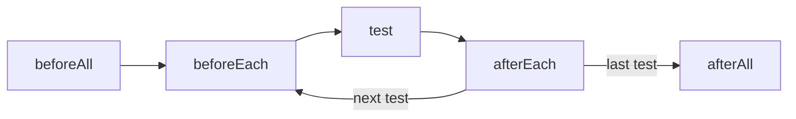
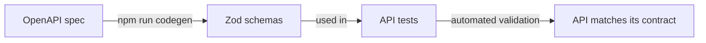

# API Testing with Playwright

Ghislain Gabriëlse & Lars de Bruijn

<!-- Ghislain -->
---
layout: presenter
presenterImage: "ghislain.jpg"
hideInToc: true
---

# Ghislain Gabriëlse

Test Automation Consultant <a  href="https://detesters.nl/">DeTesters</a>

- Woerden, Netherlands 🇳🇱
- Father of 2 minions
- Butler to a cat
- ~12 years of experience
- Builds tools that simplify complex tasks

<!-- Ghislain -->

---
layout: presenter
presenterImage: "lars.jpeg"
hideInToc: true
---

# Lars de Bruijn

Test Automation Consultant <a  href="https://techchamps.io/">TechChamps</a>

- Alblasserdam, Netherlands 🇳🇱
- Father of 7 guitars & 1 motorcycle
- ~3 years of experience
- Primary focus on Test Automation with a love for Ops side of things and Cyber Security

<!-- Lars -->
---
hideInToc: true
layout: full
layoutClass: gap-16
---
# Agenda
<Toc text-sm minDepth="1" maxDepth="1" />

<!-- Lars -->

---
layout: new-section
---

# What & why

---
layout: center
---

## What is API testing?

"API testing is a process that confirms an API is working as expected. There are several types of API tests, and each one plays a distinct role in ensuring that the API's functionality, security, and performance remain reliable."

<!-- Lars -->

---
layout: full
---

## API testing

<div style="display: flex; justify-content: center; gap: 20px; align-items: center;">
  
</div>

- Define the method + the endpoint
- Assert on the HTTP status code
- Assert on the response headers
- Assert on the response body

<!-- Lars -->

---

## Why Playwright for API testing?

- 🔗 **One framework** for UI and API tests: same runner, fixtures, reports and traces
- 🔀 **Hybrid tests**: seed data through the API, verify it in the UI (or the other way round)
- 🧰 **Batteries included**: parallelism, retries, tags, sharding, HTML report
- 🛠️ **Extensible**: fixtures, custom matchers, your favourite libraries (zod, faker, ...)

> As with any tool choice: it depends on the context of your organisation.

<!-- Ghislain -->

---
layout: new-section
---

# Setup

---

## Today's test object: booker-platform

A hotel booking platform with a REST API (Express, Prisma, JWT) and Swagger docs.

```bash
git clone https://github.com/Ghislain89/booker-platform
cd booker-platform
npm install
npm run setup    # reset the database + seed data
npm run dev      # API on http://localhost:3000/api, docs on /api-docs
```

- Seed users: `user` / `password123` and `admin` / `password123`
- Playwright starts the server for you (`webServer`) if it isn't running yet
- Messed up the data? `npm run setup` gives you a clean database

<!-- Ghislain -->

---
layout: two-cols
---

## Configuration

```ts
// playwright.config.ts
export default defineConfig({
  webServer: {
    command: 'npm run dev',
    url: 'http://localhost:3000/api-docs',
    reuseExistingServer: !process.env.CI,
  },
  projects: [{
    name: 'API',
    testDir: './playwright/tests/api',
    use: {
      baseURL: 'http://localhost:3000/api/',
      extraHTTPHeaders: {
        Accept: 'application/json',
      },
    },
  }],
});
```

::right::

### ⚠️ The baseURL gotcha

URLs are resolved like links in a browser:

| Call | Resolves to |
|---|---|
| `get('rooms')` | `…:3000/api/rooms` ✅ |
| `get('/rooms')` | `…:3000/rooms` ❌ |

End the `baseURL` with a `/` and **don't** start paths with a `/`.

<!-- Ghislain -->

---

## The `request` fixture & your own contexts

```ts
// built-in fixture: uses baseURL and extraHTTPHeaders from the config, new per test
test('list rooms', async ({ request }) => {
  const response = await request.get('rooms', { headers });
});

// your own context, for example per role
test('admin can list all bookings', async ({ playwright }) => {
  const admin = await playwright.request.newContext({
    baseURL: 'http://localhost:3000/api/',
    extraHTTPHeaders: { Authorization: `Bearer ${adminToken}` },
  });
  await expect(await admin.get('bookings')).toBeOK();
  await admin.dispose();
});
```

<!-- Ghislain -->

---

## Readable tests with `test.step`

```ts
test('Assignment 1: Authentication', async ({ request }) => {
  const user = createRandomUser();
  let token: string;

  await test.step('Register a new user with valid credentials', async () => {
    // ...
  });

  await test.step('Successfully login with the newly created user', async () => {
    // ... token = body.data.token;
  });
});
```

- Steps show up in the HTML report and the trace viewer
- Options: `{ box: true }` points errors at the step call, `{ timeout }` limits a step (1.50)

<!-- Ghislain -->

---
layout: new-section
---

# First requests

---

## GET: read data

```ts
import { test, expect } from '@playwright/test';

test('GET rooms returns a list of rooms', async ({ request }) => {
  const response = await request.get('rooms', {
    headers: { Authorization: `Bearer ${token}` },
  });

  await expect(response).toBeOK();                       // status 200-299
  expect(response.headers()['content-type']).toContain('application/json');

  const body = await response.json();
  expect(body.success).toBe(true);
  expect(body.data.length).toBeGreaterThan(0);
});
```

<!-- Ghislain -->

---

## POST: create data

```ts
test('POST auth/register creates a user', async ({ request }) => {
  const user = createRandomUser();

  const response = await request.post('auth/register', { data: user });

  expect(response.status()).toBe(201);
  const body = await response.json();
  expect(body.data.user.username).toBe(user.username);
  expect(body.data).toHaveProperty('token');
});
```

- `data` as an object is sent as JSON, with the `Content-Type` set for you
- Use `form` for URL-encoded forms and `multipart` (or `FormData`) for file uploads

<!-- Lars -->

---

## Headers & authorization

```ts
const login = await request.post('auth/login', {
  data: { username: 'user', password: 'password123' },
});
await expect(login).toBeOK();
const token: string = (await login.json()).data.token;

const response = await request.get('bookings/my-bookings', {
  headers: { Authorization: `Bearer ${token}` },
});
await expect(response).toBeOK();
```

- Headers carry metadata: content type, language, caching, ...
- `Authorization: Bearer <token>` proves who you are
- Headers you need on every request belong in `extraHTTPHeaders`

<!-- Lars -->

---

## Assertions on responses

```ts
// status
await expect(response).toBeOK();
expect(response.status()).toBe(201);

// headers
expect(response.headers()['content-type']).toContain('application/json');

// body: check the shape, not just single fields
expect(await response.json()).toMatchObject({
  success: true,
  data: { user: { username: user.username, role: 'ROLE_USER' }, token: expect.any(String) },
});
```

<!-- Lars -->

---

## Assignment 1: authentication

- Open `playwright/tests/api/assignment1.spec.ts`
- Register a new (random) user
- Log in with that user and store the token
- Log out with that token
- Assert status codes, headers and the response body

Read the Swagger docs on http://localhost:3000/api-docs and the README. When in doubt: ask 😉

<div style="display: flex; justify-content: center; gap: 20px; align-items: center; margin-top: 20px;">
  
  
</div>

<!-- Ghislain -->

---
layout: new-section
---

# Resources & roles

---

## Path & query parameters

- **Path parameters** identify one resource: `rooms/{id}`
- **Query parameters** filter, sort or paginate: `?type=SUITE&sort=-price`

```ts
// path parameter
const room = await request.get(`rooms/${roomId}`, { headers });

// query parameters: Playwright encodes them for you
const suites = await request.get('public/rooms', {
  params: { type: 'SUITE', sort: '-price', page: 1 },
});
// → GET http://localhost:3000/api/public/rooms?type=SUITE&sort=-price&page=1
```

`params` also accepts a `URLSearchParams` or a query string (1.47).

<!--
The public rooms endpoint with filters is part of the booker-platform frontend spec (A7/A8). Until it exists, use it as a syntax example only.
-->

---

## PUT & DELETE

```ts
// PUT replaces a resource (admin only for rooms)
const update = await request.put(`rooms/${roomId}`, {
  headers: adminHeaders,
  data: { ...room, price: 150 },
});
expect(update.status()).toBe(200);

// DELETE on a booking cancels it
const cancel = await request.delete(`bookings/${bookingId}`, { headers: userHeaders });
await expect(cancel).toBeOK();

// verify the result with a new request
const check = await request.get(`bookings/${bookingId}`, { headers: userHeaders });
expect((await check.json()).data.status).toBe('CANCELLED');
```

<!-- Lars -->

---

## Roles: 401 vs 403

- **401 Unauthorized**: we don't know who you are (no token)
- **403 Forbidden**: we know who you are, but you're not allowed (user token on an admin endpoint)

```ts
const anonymous = await request.post('rooms', { data: room });
expect(anonymous.status()).toBe(401);

const asUser = await request.post('rooms', { data: room, headers: userHeaders });
expect(asUser.status()).toBe(403);

const asAdmin = await request.post('rooms', { data: room, headers: adminHeaders });
expect(asAdmin.status()).toBe(201);
```

🤔 booker-platform returns `403` for an *invalid* token. Is that what you would expect?

<!-- Lars -->

---

## Assignment 2: rooms & bookings

- Continue with `playwright/tests/api/assignment2.spec.ts`
- Find a room and conclude none is to your liking
- Add a new room as admin. Construction will surely be done before you go 🙂
- Book your new room as a regular user
- The kids bring the flu home from daycare: cancel the booking and verify it's cancelled
- Tip: the API rejects bookings in the past and bookings that overlap. Check the status codes in Swagger

<div style="display: flex; justify-content: center; gap: 20px; align-items: center; margin-top: 20px;">
  
  
</div>

<!-- Ghislain -->

---
layout: new-section
---

# Scaling up

---

## Data factories & helpers

```ts
// playwright/support/datafactories/user.factory.ts
export function createRandomUser() {
  const username = `test_${Date.now()}_${faker.string.alphanumeric(8)}`;
  return {
    username,
    password: faker.internet.password(),
    email: `${username}@example.com`,
  };
}
```

- Factories build request bodies with unique data, so tests can run in parallel
- Helpers wrap repeated actions, such as logging in
- Balance DRY and KISS: these principles *can, and probably will,* bite each other

<!-- Ghislain -->

---

## Test data through a test-support API

```ts
test.beforeAll(async ({ request }, testInfo) => {
  const namespace = `w${testInfo.workerIndex}`; // one namespace per worker
  const response = await request.post('testing/seed', {
    data: {
      namespace,
      users: [{ username: 'alice' }],
      rooms: [{ number: '101', type: 'SUITE', price: 150, capacity: 2 }],
    },
  });
  const { users, rooms } = (await response.json()).data; // users[0].token, rooms[0].id
});

test.afterAll(({ request }, testInfo) => request.delete(`testing/namespace/w${testInfo.workerIndex}`));
```

- Many apps have a backdoor like this for tests. Seeding through an API is faster and more reliable than through the UI
- A namespace per worker keeps parallel workers out of each other's data
- `POST testing/reset` restores the seed data, but don't call it while other workers are running
- Only in development and test environments. See `/api-docs` → Testing

<!-- Ghislain -->

---

## Hooks



- `beforeEach` / `afterEach` run around **every** test
- `beforeAll` / `afterAll` run once per **worker**, not once per run: with 4 workers they run 4 times
- Hooks don't travel between files. For reusable setup, use **fixtures**

<!-- Ghislain -->

---

## Fixtures: an API client

```ts
// playwright/support/fixtures/test.fixture.ts
export const test = baseTest.extend<{ api: ApiFixture }>({
  api: async ({ request }, use) => {
    await use(new ApiFixture(request));   // wraps APIRequestContext
  },
});
```

```ts
// in a test: no more repeated headers and json() parsing
test('list rooms', async ({ api }) => {
  const { statusCode, responseBody } = await api.get('rooms', token);
  expect(statusCode).toBe(200);
});
```

<!-- Ghislain -->

---

## Shared authentication: a worker fixture

```ts
export const test = base.extend<{}, { adminToken: string }>({
  adminToken: [async ({ playwright }, use) => {
    const ctx = await playwright.request.newContext({ baseURL: 'http://localhost:3000/api/' });
    const login = await ctx.post('auth/login', {
      data: { username: 'admin', password: 'password123' },
    });
    await use((await login.json()).data.token);   // log in once per worker
    await ctx.dispose();
  }, { scope: 'worker' }],
});
```

Alternative: build a context with `extraHTTPHeaders: { Authorization: ... }` and expose it as an `adminApi` fixture.

<!-- Ghislain -->

---

## Schema validation



- Checking every field by hand against the Swagger docs is cumbersome
- booker-platform generates Zod schemas from its OpenAPI spec with orval
- Validate every response against its schema: contract testing *lite*

<!-- Lars -->

---

## Custom matcher: `toMatchSchema`

```ts
// playwright/support/fixtures/expect.fixture.ts
export const expect = baseExpect.extend({
  async toMatchSchema(received: unknown, schema: ZodTypeAny) {
    const result = await schema.safeParseAsync(received);
    return {
      pass: result.success,
      name: 'toMatchSchema',
      message: () => result.success ? 'schema matched' : `Schema mismatch: ${result.error.message}`,
    };
  },
});

const responseBody: unknown = await response.json();
await expect(responseBody).toMatchSchema(getApiRoomsResponse);
```

- `json()` returns `any`, and Playwright's types hide custom matchers on `any` values. Type the body as `unknown` (or a real type) first

<!-- Lars -->

---

## Typed responses

Since 1.63 the request methods take a type parameter, so `json()` is typed:

```ts
type Room = { id: string; number: string; type: string; price: number; capacity: number };
type ApiResponse<T> = { success: boolean; data: T };

const response = await request.get<ApiResponse<Room[]>>('rooms', { headers });
const body = await response.json();        // ApiResponse<Room[]>
expect(body.data[0].price).toBeGreaterThan(0);
```

- Autocomplete and compile errors instead of typos in property names
- Types are not validation: combine them with schema checks

<!-- Ghislain -->

---

## Bonus assignment

Start from `playwright/tests/api/bonus.spec.ts` (a copy of assignment 2):

- How could we improve our setup?
- Can we make our tests more readable? (fixtures, helpers)
- Can we reuse the same authenticated state for all tests?
- Can we check that every response is structured correctly, without validating it in every test?

<div style="display: flex; justify-content: center; gap: 20px; align-items: center; margin-top: 20px;">
  
  
</div>

<!-- Ghislain -->

---
layout: new-section
---

# Extras

---

## Useful request options

```ts
const api = await playwright.request.newContext({
  baseURL: 'http://localhost:3000/api/',
  failOnStatusCode: true,   // throw on non-2xx/3xx responses (1.51)
  timeout: 10_000,
});

await api.post(`rooms/${roomId}/image`, { multipart: formData });   // FormData (1.44)
await api.post('contact', { form: new URLSearchParams({ name, email }) }); // URL-encoded (1.47)

const response = await api.get('rooms');
console.log(response.timing());     // DNS, connect, request and response timings (1.62)
```

`failOnStatusCode` is handy for setup code, but not for negative tests.

<!-- Lars -->

---

## Reports & traces for API tests

- `trace: 'on'` records every API call: method, URL, headers, body and timing
- The HTML report shows steps and errors, with **Copy prompt** for your AI assistant (1.51)
- Attach responses yourself: `await testInfo.attach('response', { body, contentType: 'application/json' })`
- Tags and filters: `test('...', { tag: '@smoke' }, ...)` and `--grep @smoke`
- Catch flaky tests in CI: `retries` + `--fail-on-flaky-tests` (1.45)

<!-- Lars -->

---

## From API to UI: hybrid tests

```ts
// UI project: baseURL is http://localhost:3000, so the path includes /api
test('a booking made via the API shows up in the UI', async ({ page, request }) => {
  const booking = await request.post('/api/bookings', { headers, data: newBooking });
  await expect(booking).toBeOK();

  await page.goto('/my/bookings');
  await expect(page.getByRole('row', { name: /June 1, 2030/ })).toBeVisible();
});
```

- API calls are fast: use them to set up data for UI tests
- Or act in the UI and verify the result through the API
- Covered in depth in the Playwright UI workshop

<!-- Ghislain -->

---
layout: new-section
---

# Wrap-up

---

## Thank you!

- Test object and assignments: https://github.com/Ghislain89/booker-platform
- Solutions: the [`solutions`](https://github.com/Ghislain89/booker-platform/tree/solutions) branch
- All assignments: https://ghislain.dev/playwright/assignments.html
- Playwright API testing docs: https://playwright.dev/docs/api-testing
- These slides: https://github.com/Ghislain89/presentations/tree/main/decks/playwright-training

Questions or feedback? Let us know!

<!-- Ghislain -->
