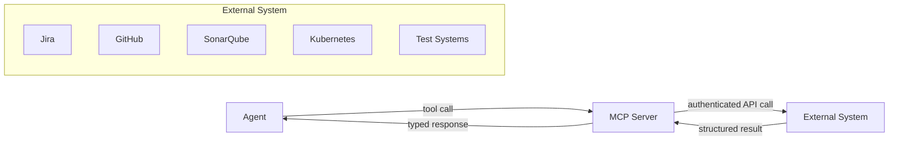
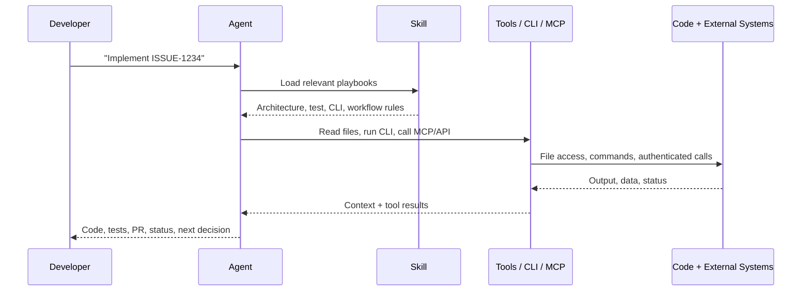
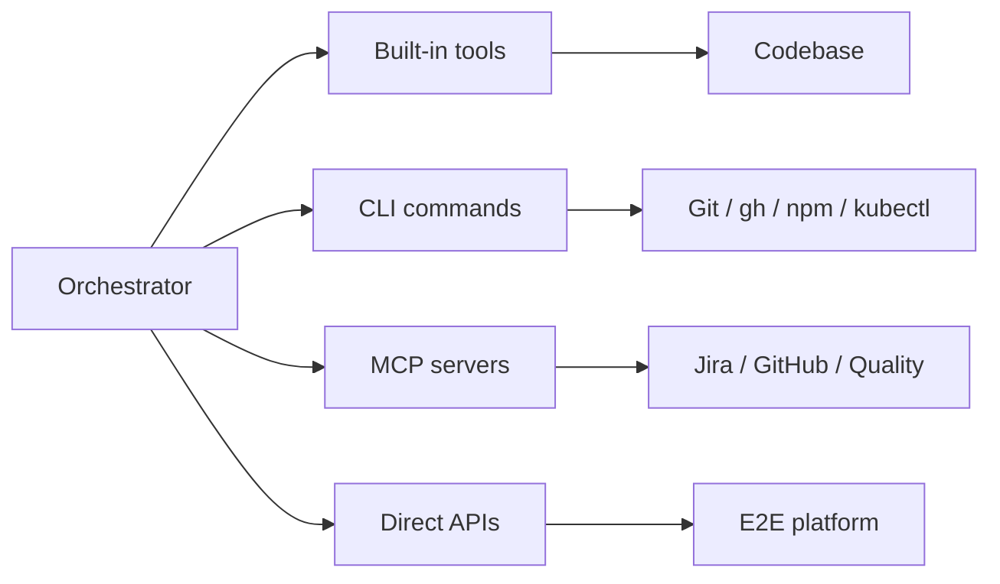
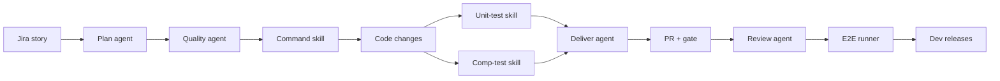

# Agents, Skills & MCP Servers

A practical 101 for AI-supported development


<!--
Welcome everyone. This is a practical, hands-on introduction to agents, skills, and MCP servers — and how they support real development work. Before we dive in, a quick word about who I am and why this matters to me.
-->

---
hideInToc: true
---

# Ghislain Gabriëlse

Test Automation Consultant <a href="https://detesters.nl/">DeTesters</a>

- Woerden, Netherlands 🇳🇱
- Father of 2 minions
- ~12 years of experience
- Builds tools that simplify complex development workflows
- Daily focus: AI-assisted software delivery, testing, and quality automation

<!--
A quick intro so you know where I'm coming from. My day-to-day isn't just asking an AI to write code — it's designing workflows where an AI assistant can safely help with real engineering tasks: planning, coding, testing, reviewing, and delivery. So instead of opening with definitions, let me show you what that actually looks like on a normal day — starting with a feature orchestrator.
-->

---
layout: default
hideInToc: true
---

# Feature Orchestrator — Daily Workflow in One Minute

A feature orchestrator turns **one development request** into a coordinated delivery workflow.

<div class="grid grid-cols-[1fr_auto_1fr_auto_1fr] gap-4 items-center mt-8">
<div class="border rounded p-5 bg-purple-900/20 border-purple-400/40">

## Input

Developer intent

Issue context

Acceptance criteria

<div class="mt-3 text-sm italic opacity-70">⚠️ Garbage in → garbage out</div>

</div>
<div class="text-4xl opacity-70">→</div>
<div class="border rounded p-5 bg-pink-900/20 border-pink-400/40">

## Orchestrator

Plans work

Delegates specialists

Tracks delivery flow

</div>
<div class="text-4xl opacity-70">→</div>
<div class="border rounded p-5 bg-blue-900/20 border-blue-400/40">

## Outcomes

Code + tests

Pull request

Validation evidence

</div>
</div>

<div class="mt-8 text-xl">

**One request in — code, tests, a pull request, and validation out.**

</div>

<!--
This is the hook. I want to open by showing the destination, not the theory. One request goes in; code, tests, a pull request, and validation come out. That's a normal Tuesday. In my daily work I can start from a single development request and an orchestrator carries it through planning, quality strategy, implementation, delivery, review, and end-to-end validation. It looks like magic. But one honest caveat before we take it apart: it's garbage in, garbage out. Look at that Input box — feed it a vague ticket, missing acceptance criteria, or sloppy conventions, and the orchestrator will faithfully turn weak input into a weak pull request. It amplifies the quality of what you give it; it can't invent quality you never provided. Hold onto both of those — that first impression, and the catch that it's only as good as its inputs — because the rest of the talk is about taking it apart and showing you there's a small set of moving parts behind it, each of which you have to get right.
-->

---
layout: default
hideInToc: true
---

# Wait — How Is That Even Possible?

A language model, on its own, **cannot**:

<div class="grid grid-cols-3 gap-5 mt-8">
<div class="border rounded p-5 bg-red-900/20 border-red-400/40">

### ❌ Open the ticket

No access to Jira, GitHub, or your pipeline.

</div>
<div class="border rounded p-5 bg-red-900/20 border-red-400/40">

### ❌ Know your conventions

It writes *generic* code — not *your* architecture.

</div>
<div class="border rounded p-5 bg-red-900/20 border-red-400/40">

### ❌ Run your checks

It can't build, test, or verify anything itself.

</div>
</div>

<div class="mt-8 text-xl">

So the orchestrator is **not** the model. It's the model **plus three things** — and that's our story today.

</div>

<!--
Here's the tension that drives everything. A chat model is brilliant at language, but on its own it is blind, forgetful, and powerless in our world. It can't open the ticket. It doesn't know our architecture, so it writes generic textbook code. And it can't run a single test to check its own work. So how did that orchestrator on the previous slide do all of it? Because it isn't just a model. It's a model wrapped in three things. Meet them, and the magic disappears.
-->

---
hideInToc: true
---

# Our Journey Today

We'll follow one ticket — **ISSUE-1234: "Add a POST endpoint to create orders"** — from request to a ready-to-merge pull request.

<div class="grid grid-cols-2 gap-6 mt-8">
<div class="border rounded p-5 bg-purple-900/20 border-purple-400/40">

## 1. Meet the team

The three jobs hiding behind the magic.

</div>
<div class="border rounded p-5 bg-pink-900/20 border-pink-400/40">

## 2. A day in the life of ISSUE-1234

The team collaborating on one real ticket.

</div>
<div class="border rounded p-5 bg-blue-900/20 border-blue-400/40">

## 3. Zooming out

How the same pieces support the whole lifecycle.

</div>
<div class="border rounded p-5 bg-green-900/20 border-green-400/40">

## 4. Your turn

A blueprint to build your own.

</div>
</div>

<!--
Here's the shape of the story. First I'll introduce the team: the three jobs that turn a chat model into a teammate. Then we'll follow one concrete ticket, ISSUE-1234, and watch the team collaborate on it from request to a reviewed, ready-to-merge pull request. Then we'll zoom out and see how the same pattern supports the whole development lifecycle. And finally I'll hand you a blueprint so you can build one yourself. One ticket is our thread the whole way through.
-->

---
layout: section
---

# First, Meet the Team

*Three jobs that turn a chat model into a teammate.*

<!--
Before we can follow ISSUE-1234, we need to know who's working on it. So let's meet the team. There are three distinct jobs here, and the most common mistake is blurring them together. Agents, skills, and capabilities. Keep them separate in your head and the whole system suddenly makes sense.
-->

---
layout: default
hideInToc: true
---

# The Team: Three Jobs

<div class="grid grid-cols-3 gap-5 mt-8">
<div class="border rounded p-5 bg-purple-900/20 border-purple-400/40">

## 🤖 Agent

Owns a task.

Plans, executes, uses tools, and reports outcome.

</div>
<div class="border rounded p-5 bg-pink-900/20 border-pink-400/40">

## 📚 Skill

Provides know-how.

Injects domain rules, examples, templates, and constraints.

</div>
<div class="border rounded p-5 bg-blue-900/20 border-blue-400/40">

## 🔌 Capability

Connects systems.

Can be a built-in tool, CLI command, script, API client, or MCP server.

</div>
</div>

<div class="mt-8 text-xl">

Together: **workflow + knowledge + execution capability**.

</div>

<!--
Here's the whole team on one slide. The agent owns the work — it plans and acts. The skill is the playbook — it carries the knowledge of how we do things here. The capability is the hands — the way the agent actually touches files, runs commands, and reaches systems. MCP is one kind of capability, but only one. None of these is enough alone: an agent with no skills writes generic code; a skill with no one acting on it is inert — it needs an agent, or a developer in a prompting session, to put it to work; and capabilities with nobody to drive them do nothing. Let's start with the agent.
-->

---
layout: default
hideInToc: true
---

# Agent = Role + Goal + Autonomy

An agent is a bounded worker with a specific mission.

| Part | Meaning | Example |
|---|---|---|
| **Role** | What kind of worker is this? | Feature planner, code reviewer, e2e runner |
| **Goal** | What outcome must it produce? | PR created, tests run, Jira updated |
| **Autonomy** | Which steps can it take by itself? | Search code, run tests, call tools, delegate |
| **Boundary** | What must it not do? | Avoid unrelated changes, ask before risky actions |

> Good agents have narrow ownership. Bad agents are vague "do everything" prompts.

<!--
An agent is not just a prompt with a fancy name. A useful agent has a role, a goal, some autonomy, and clear boundaries. For ISSUE-1234, the implementation agent's job is "turn this story into working, tested code" — and crucially, "stop and ask before doing anything risky." But notice the gap: an agent can be perfectly eager and capable and still hand you generic textbook code, because it doesn't know your architecture, your naming, your testing style. That knowledge has to come from somewhere. That's the next member of the team.
-->

---
layout: default
hideInToc: true
---

# Skill = Reusable Domain Know-How

Skills are context packages that teach the assistant **how we work here**.

```markdown
# quarkus-command-endpoint

## Description
Create Quarkus POST command endpoints for state-changing operations.

## Instructions
- Use hexagonal architecture
- Keep business logic out of REST resources
- Validate DTOs with Jakarta validation
- Add command endpoint tests

## References
- resource-template.java
- command-test-template.java
```

<div class="mt-4">

**A skill is not the worker. A skill is the worker's playbook.**

</div>

<!--
Here's the playbook for our ticket. This skill tells the agent exactly how we build a command endpoint: hexagonal architecture, no logic in the resource, validated DTOs, tests alongside. Suddenly the generic code becomes our code. Skills carry the conventions the base model can't reliably know — architecture, naming, testing style, even how to use our CLIs correctly. They're small, versioned, and testable, just like code. And here's the part that makes it click: a skill like this is just a markdown file — and so is an agent. Before we give the agent hands, let me show you both, side by side.
-->

---
layout: default
hideInToc: true
---

# It's Just Text — Not Magic

An **agent** and a **skill**, side by side. Both are plain markdown: frontmatter says *what it is*, prose says *how we work*.

<div class="grid grid-cols-2 gap-4 mt-2 text-sm">

<div>

**`dev-agent.agent.md`** — *decides & acts (generic)*

```yaml
---
name: dev-agent
description: Implement a development ticket end to end — code, tests, PR.
tools: [read, edit, execute, task]
---

Given a ticket, implement it the way this team works.
Walk the change through every layer it touches, then open a PR.
Load the relevant skills. Stop and ask before anything risky.
```

</div>

<div>

**`post-endpoint-conventions/SKILL.md`** — *teaches*

```yaml
---
name: post-endpoint-conventions
description: How we build POST command endpoints here.
---

- Hexagonal: keep business logic out of the resource
- Validate request DTOs with Jakarta validation
- Add a command test and a component test
```

</div>

</div>

> The only difference that matters: the agent has `tools` and can **act**; the skill has none — it only **teaches**. If you can write a README, you can write either one. *(Both files are in the handout.)*

<!--
This is the demystifying slide. People picture agents and skills as some special runtime, some clever machinery humming under the hood. They're not. On the left is an agent: a few lines of frontmatter saying what it is and what it's allowed to do, then plain instructions. Notice it's generic — that same agent could pick up almost any ticket; nothing in it is bolted to one story. On the right is a skill: the same shape, except it only teaches, and it's the skill that carries what's specific to how we build POST endpoints. Notice it has no tools, so it executes nothing. Hand the generic agent a ticket and it loads the right skill — that pairing is what turns a general worker into an expert in our codebase. Open any agent or skill in our entire setup and this is all you'll find: a little YAML and some prose describing how we work. That's the whole trick. If you can write a README, you can write one of these — and there's a copy of both in the handout to start from. But look at what's missing: neither file can open a file or call Jira on its own. It's still just text. To actually act, the agent needs hands — and that's where capabilities come in.
-->

---
layout: default
hideInToc: true
---

# MCP Server = Structured Tool Bridge

Model Context Protocol servers expose capabilities as structured tools.



<div class="mt-4">

MCP is useful when a capability needs a stable contract: **parameters, permissions, typed output, and reusable tool semantics**.

</div>

<!--
So the agent gets its hands through capabilities, and MCP is the most talked-about kind. For ISSUE-1234, an MCP server could expose "get the issue", "create the PR", "fetch the quality gate" as clean, typed, permissioned tools. That's far safer than letting the model improvise browser clicks or guess at API calls. But here's the nuance people miss: MCP is not the only way to give an agent hands. If a reliable CLI already exists, we don't need to wrap it in a server — we can just teach the agent to use it. That distinction, server versus skill, is exactly what the next slide unpacks.
-->

---
layout: default
hideInToc: true
---

# Skills Can Teach Tool Usage

Some skills are less about architecture and more about **how to operate an existing tool**.

```markdown
# github-cli-workflow

## Instructions
- Use `gh pr view --json ...` for PR metadata
- Use `gh pr checks` before reporting delivery status
- Prefer non-interactive commands
- Never force-push unless explicitly approved
```

<div class="grid grid-cols-2 gap-8 mt-6">
<div>

### Skill provides

- Command patterns
- Required flags
- Safety rules
- Output interpretation

</div>
<div>

### Agent does

- Chooses when to run it
- Executes via shell/tooling
- Reads output
- Decides next step

</div>
</div>

<!--
This slide is the reason MCP isn't the whole story. In our setup, plenty of "hands" are just skills that teach the agent how to drive an existing tool. A GitHub CLI skill spells out which gh commands to use, which JSON fields to ask for, and which dangerous operations to never run. The skill doesn't execute anything — it teaches the agent to execute safely. So skills play two roles: they teach how we build, and they teach how we operate our tools. Hold that thought, because it means our real setup is a blend.
-->

---
layout: default
hideInToc: true
---

# Our Setup: One Team, Many Kinds of Hands

Our agents and skills use **several capability paths**, depending on the job.

| Layer | Examples | Why |
|---|---|---|
| **Agents** | feature planning, implementation, delivery, review, e2e | Own multi-step outcomes |
| **Skills** | GitHub CLI usage, Jira workflow, test strategy, code review, platform operations | Teach process and tool-specific rules |
| **Built-in tools** | search, read, edit files, run commands | Direct local workspace work |
| **CLIs/scripts** | `git`, `gh`, `npm`, `curl`, deployment/test CLIs | Reuse mature operational interfaces |
| **MCP/API tools** | structured issue, PR, quality, environment operations | Use when a typed reusable contract is valuable |

> Match the capability to the job — the simplest safe option wins.

<!--
So this is the real picture, and it's a blend. Agents own outcomes. Skills teach both how we build and how we operate our tools. Built-in tools handle the codebase. CLIs are perfect when mature command-line tooling already exists. And MCP or direct APIs shine when we want a structured, reusable, authenticated contract. The art is choosing the simplest safe option for each job rather than forcing everything through one mechanism. Now you've met everyone — let's watch them collaborate.
-->

---
layout: default
hideInToc: true
---

# How They Work Together

<div style="transform: translateX(-3rem)">



</div>

> Agent decides **what to do next**. Skill shapes **how to do it**. Tools, CLIs, APIs, and MCP enable **doing it**.

<!--
This one slide is the whole team in motion. The developer says "implement ISSUE-1234." The agent loads the relevant skills, then uses its hands — files, CLI, MCP, APIs — to read the code, make changes, and run checks, looping until it's done, then reports back. Agent decides what, skill shapes how, capabilities do it. That's the engine. But every one of those loops shares one hidden, finite resource — and how we spend it decides whether the whole thing stays sharp. Before we follow a real ticket, let's look at the context window.
-->

---
layout: default
hideInToc: true
---

# The Hidden Constraint: The Context Window

The context window is the model's **working memory** — everything it can see at once, counted in tokens. It is finite, and every token competes with every other.

<div class="grid grid-cols-2 gap-6 mt-6 text-sm">
<div class="border rounded p-4 bg-purple-900/20 border-purple-400/40">

### What fills it

- System & agent instructions
- Loaded skills
- Tool definitions from connected MCP servers
- Conversation history
- Files read and tool outputs

</div>
<div class="border rounded p-4 bg-pink-900/20 border-pink-400/40">

### Why it matters

- A fixed budget — when it fills, context gets dropped or summarized
- More loaded ⇒ less room to reason ⇒ quality drops ("lost in the middle")
- Latency and cost rise with every token

</div>
</div>

> Agents, skills, and MCP servers are, in part, strategies for spending this budget well.

<!--
Here's the thing nobody mentions in the demos. Everything the model does happens inside one finite working memory — the context window. It's measured in tokens, and it holds all of it at once: the instructions, the skills you've loaded, the tool definitions from every connected server, the whole conversation, and every file and command output. That budget is fixed. When it fills up, something has to give — older context gets dropped or compressed, and the model literally starts to forget. And there's a subtler tax: the more you cram in, the less headroom is left for actual reasoning, and answers get worse even before you hit the limit. So the real question behind agents, skills, and MCP isn't just what they can do — it's what each one costs you and what it saves you, token by token. Let's take them one player at a time.
-->

---
layout: default
hideInToc: true
---

# How the Team Spends the Budget

Each player has a cost — and a way it actually protects the budget.

| Player | What it costs | How it helps |
|---|---|---|
| **Agents** | Each agent adds its own instructions; orchestration adds coordination overhead | Sub-agents run in their **own** window — noisy work (read 20 files, run the suite) returns as a short summary, keeping the main thread clean |
| **Skills** | A loaded skill consumes tokens while active | **Progressive disclosure**: only name + description stays loaded; the full playbook loads on demand, then leaves |
| **MCP servers** | Every connected server injects **all** its tool schemas up front; results can be large | Typed results are compact; tools fetch on demand instead of pre-loading raw data |

> The win is loading the right context at the right time — not all of it, all the time.

<!--
Start with the agents. Each one adds its own instructions, and coordinating several of them isn't free — but here's the trick that pays for all of it: a sub-agent runs in its own separate context window. So when the orchestrator delegates "run the whole test suite" or "read these twenty files," that mess happens somewhere else, and only a tidy summary comes back. Delegation is context isolation. Skills come next: a skill costs tokens while it's active, but it uses progressive disclosure — only the name and one-line description sit in memory permanently, and the full playbook is pulled in only when it's relevant, then released. And MCP servers are the sneaky one: the moment you connect a server, every one of its tool definitions — names, descriptions, full JSON schemas — gets injected into the window before you've done anything. Connect five servers and you've spent a chunk of your budget on a menu you're mostly not using. The upside is that typed results come back compact and tools pull data on demand. Same lesson three times over: load the right context at the right time, not everything all the time.
-->

---
layout: default
hideInToc: true
---

# Budgeting the Window

Practical habits that keep an agent sharp instead of bloated.

<div class="grid grid-cols-2 gap-6 mt-6 text-sm">
<div>

### Spend less

- Keep skills small and focused; load on demand
- Connect only the MCP servers a task actually needs
- Prefer compact tool output — filter, paginate, summarize

</div>
<div>

### Free up room

- Delegate large or noisy work to sub-agents; let summaries return, not raw output
- Checkpoint or summarize long sessions before they overflow
- Drop context you're done with instead of carrying it forever

</div>
</div>

> A focused window is a sharper agent.

<!--
So what do you actually do with this? A few habits. On the spending side: keep skills small and pull them in only when needed; connect only the MCP servers a given task needs, because each one taxes you whether you call it or not; and ask tools for compact output instead of dumping everything. On the freeing-up side: push big, noisy jobs to sub-agents so only the summary comes home; checkpoint or summarize long-running sessions before they overflow; and let go of context once you're finished with it. None of this is exotic — it's budgeting. And the reason it's worth caring about is simple: a focused window is a sharper agent. Keep that mental model in your pocket, because now we're going to watch all of this play out on one real ticket, end to end.
-->

---
layout: section
---

# A Day in the Life of ISSUE-1234

*Watch the team collaborate on one real ticket.*

<!--
Time to make it concrete. ISSUE-1234 is a real-shaped ticket: add a POST endpoint to create orders. Watch how the orchestrator pulls in the right agents, the right skills, and the right capabilities at each step. This is where the abstract team becomes an actual delivery.
-->

---
layout: default
hideInToc: true
---

# The Orchestrator Doesn't Do It All

When ISSUE-1234 lands, the orchestrator **delegates each phase to a specialist**.

| Specialist agent | Responsibility |
|---|---|
| **Feature plan** | Understand Jira, inspect codebase, create implementation plan |
| **Quality plan** | Risk, testability, test strategy, coverage manifest |
| **Feature implement** | Create branch, modify code, write tests, manage subtasks |
| **Feature deliver** | Run checks, create PRs, coordinate merge order |
| **Feature review** | Review PR with multiple perspectives and consolidate findings |
| **E2E runner** | Queue deployed feature for end-to-end validation |

<div class="mt-4 text-xl">

The orchestrator owns **flow**. Specialists own **phase outcomes**.

</div>

> Specialists run in isolation — they can't see each other's work. They coordinate through a shared **state file** the orchestrator and agents read and write between phases.

<!--
First stop on the ticket's journey: the orchestrator looks at ISSUE-1234 and immediately delegates. A plan agent figures out what's involved, a quality agent works out the test strategy, an implement agent writes the code, a deliver agent opens the PR, a review agent checks it, and an e2e runner validates it. The orchestrator never tries to be an expert at everything — it conducts. That's why it scales and stays understandable. But there's a catch with splitting work across agents: each specialist runs in its own context window, so it has no idea what the others have done — they don't share a memory. The way we get around that is a shared state file. The orchestrator and the agents read and write it between phases, recording the plan, the decisions made, what's finished, and what comes next. That file is the connective tissue that keeps six isolated agents working on one coherent ticket. And each of those specialists is still just an agent; what makes them genuinely useful is their know-how — so let's look at the skills they pull in.
-->

---
layout: default
hideInToc: true
---

# The Know-How They Pull In

ISSUE-1234 crosses many domains — so the agents reach for many skills.

| Skill family | What it contributes |
|---|---|
| **API contracts** | Contract-first changes, snapshots, merge order |
| **Backend development** | Domain, command, query, repository, messaging, process |
| **Frontend development** | Angular patterns, migration, app smoke testing |
| **Testing** | Unit, component, contract, regression, tenant selection |
| **Delivery** | Git workflow, PR template, SonarQube, security scan |
| **Operations** | Kubernetes, ArgoCD, platform tools, e2e environments |

> Skills encode local engineering judgement so every agent does not have to rediscover it.

<!--
Our ticket doesn't live in one corner of the codebase. To deliver it well, the agents reach for a whole shelf of skills: respect the API contract workflow, follow backend patterns, apply the right testing levels, and obey the delivery and operations conventions. Each skill is a piece of hard-won team judgement that the agent would otherwise have to guess at. That's how generic competence becomes our competence. Now the agents know what good looks like — next they need the hands to make it real.
-->

---
layout: default
hideInToc: true
---

# The Hands It Reaches For

To finish ISSUE-1234, the agents need to touch real systems.

<div class="grid grid-cols-2 gap-8 mt-4">
<div>

### Planning and source control

- Jira issue lookup and updates
- Git branch and diff operations via CLI
- GitHub PR creation and review
- Repository file search and editing

</div>
<div>

### Quality and deployment

- Build, test, lint execution
- SonarQube quality checks
- Test execution systems
- ArgoCD / Kubernetes / platform health

</div>
</div>



<!--
And here are the hands. To actually ship ISSUE-1234 the agents read and edit files, run git and the test suite, open a PR, and check the quality gate. But notice they don't all use the same kind of hand. Built-in tools handle the files. CLI commands drive git, gh, npm, kubectl — tools that already exist and work. MCP wraps the things we want as clean reusable contracts. Direct APIs cover the rest. Choosing the right hand for each job is a design decision, not an afterthought.
-->

---
layout: default
hideInToc: true
---

# ISSUE-1234, From Request to Pull Request



<div class="mt-4">

One ticket, **multiple agents**, **multiple skills**, **multiple kinds of hands** — all coordinated.

</div>

<!--
This is ISSUE-1234's whole journey on one slide. It starts as a story and ends as a reviewed, validated pull request — but look at everything in between. The plan and quality agents shape the approach. The command skill and test skills shape the code and its tests. The deliver agent opens the PR and runs the gate. The review agent inspects it. The e2e runner validates it. And then it stops: the agents don't merge anything. They hand the developer a tested, reviewed PR, and the human decides when to merge and release. Here's the takeaway. "Add a POST endpoint" sounded like one small change, but doing it properly touched the domain, the repository, two layers of tests, a pull request, review, and validation. That breadth is exactly where the orchestrator earns its keep: it carries the ticket through every one of those stages, handing each to the right specialist, without skipping a single one — right up to the point where a person takes over. That's the payoff of meeting the team — and the same pattern, it turns out, reaches well beyond this one ticket.
-->

---
layout: section
---

# Zooming Out: The Whole Lifecycle

*ISSUE-1234 was one ticket. The same pattern helps before, during, and after — every time.*

<!--
We followed one ticket closely. Now let's pull the camera back. The beautiful thing is that the same team — agents, skills, capabilities — shows up across the entire development lifecycle, not just implementation. But the shape of the help changes at each phase. Let's walk through before, during, and after development, and you'll recognise the same pieces playing different roles.
-->

---
layout: default
hideInToc: true
---

# The Same Trio, Every Phase

We just watched implementation up close. Pull back, and the **same three jobs** show up across the whole lifecycle — only their roles change.

| Phase | Agent role | Skill support | Capability |
|---|---|---|---|
| **Before** | Plan the work, split into subtasks | Risk, testability, architecture conventions | Jira, repository search |
| **During** | Implement, run checks, loop until green | Patterns, naming, testing style | Files, build/test, CLI |
| **After** | Deliver, review, validate | PR template, security scan, e2e rules | GitHub, SonarQube, e2e platform |

<div class="mt-6 text-xl">

Net effect: less boilerplate, consistent architecture, tests with the code, faster feedback — with humans still owning the decisions.

</div>

<!--
Here's the whole lifecycle in one frame. The same three jobs reappear at every phase — only their roles shift. Before a line is written, agents plan and split the work, skills bring risk and testability judgement, and capabilities pull in Jira and the codebase: ambiguous work becomes an executable plan. During the build, the agent implements and loops on targeted checks while skills keep everything aligned with our conventions. After the code is green, the work turns into evidence — validation, a pull request, review, and e2e — with delivery agents removing hours of coordination. The net effect is real: less boilerplate, consistent architecture, tests written with the code, faster feedback. But notice how much we've just handed to an automated system — planning, editing, opening PRs, triggering deployments. Power like that needs boundaries, which brings us to guardrails.
-->

---
layout: default
hideInToc: true
---

# Human-in-the-Loop Guardrails

AI-supported development needs boundaries.

<div class="grid grid-cols-2 gap-8 mt-6">
<div>

### Keep autonomous

- Code search
- Boilerplate implementation
- Targeted test execution
- Status summaries
- PR description drafting

</div>
<div>

### Require human decision

- Scope changes
- Risk acceptance
- Destructive actions
- Security-sensitive changes
- Business behavior changes

</div>
</div>

<div class="mt-6 text-xl">

Autonomy is useful only when the boundary is explicit.

</div>

<!--
This is the discipline that makes the whole thing trustworthy. The goal is never maximum autonomy — it's appropriate autonomy. Let the assistant own the repeatable engineering work: search, boilerplate, targeted tests, status summaries, PR drafts. But make it stop and ask the moment a decision touches scope, risk, security, or business behavior. That single boundary is what lets you sleep at night while an agent works on ISSUE-1234. Right — you've now seen the full picture, from wow to lifecycle. Let's turn it into something you can build.
-->

---
layout: section
---

# Your Turn: Build One Yourself

*From one orchestrator example to a blueprint you can reuse.*

<!--
You've seen my orchestrator and followed one ticket through it. None of this is exotic — it's a pattern you can copy. This last act is the practical takeaway: how to design your own setup without getting lost. And it starts somewhere surprising — not with the model.
-->

---
layout: default
hideInToc: true
---

# Start With the Workflow, Not the Model

Ask four questions:

<div class="grid grid-cols-2 gap-6 mt-6">
<div class="border rounded p-4 bg-purple-900/20 border-purple-400/40">

## 1. What task repeats?

Planning, implementation, review, release, e2e?

</div>
<div class="border rounded p-4 bg-pink-900/20 border-pink-400/40">

## 2. What knowledge is local?

Architecture, testing rules, naming, compliance?

</div>
<div class="border rounded p-4 bg-blue-900/20 border-blue-400/40">

## 3. Which capabilities are needed?

Built-in tools, CLI, scripts, APIs, MCP?

</div>
<div class="border rounded p-4 bg-green-900/20 border-green-400/40">

## 4. Where are the boundaries?

Approval points, permissions, destructive actions?

</div>
</div>

<div class="mt-6">

Then wire the four answers into one workflow → **test with realistic scenarios** → **iterate**. Version, review, and test agents and skills like any other code.

</div>

<!--
Do not begin by asking "which model should we use?" Start with the development workflow. What repeats? That becomes an agent. What knowledge is specific to your organization? That becomes a skill. Which capabilities does the assistant actually need? And where must it stop and ask? Once you have those four answers, wire them into a single workflow, test it against realistic scenarios, and iterate. And treat the agents and skills themselves like software — versioned, reviewed, and tested. That discipline is exactly what turns a lucky prompt into a reliable system.
-->

---
layout: default
hideInToc: true
---

# Patterns That Work

<div class="grid grid-cols-2 gap-8 mt-4">
<div>

### ✅ Strong patterns

- One agent per workflow phase
- Small skills with clear trigger descriptions
- Skills that document safe CLI usage
- Generate skills from existing docs — e.g. Anthropic's skill creator
- Structured tools where contracts matter
- Cheap checks before expensive checks
- PR-visible summaries and evidence

</div>
<div>

### ❌ Common traps

- One giant "do everything" agent
- Skills full of generic advice
- Treating every integration as MCP
- Uncontrolled shell/browser automation
- No test strategy for AI behavior
- Silent failures and optimistic summaries

</div>
</div>

> Reliable AI workflows are engineered systems, not lucky prompts.

<!--
These are the practical patterns. The best results come from focused agents, focused skills, intentional capability choices, and evidence. The biggest trap is thinking that a long prompt and a powerful model are enough. Another trap is turning every integration into MCP when a well-documented CLI skill would be simpler and safer. And a practical shortcut for getting started: you don't have to write skills from scratch — point an AI at your existing documentation, runbooks, and conventions and have it draft the skill for you. Anthropic's skill creator is a great resource for exactly that.
-->

---
layout: default
hideInToc: true
---

# Key Takeaways

<div class="grid grid-cols-3 gap-5 mt-8">
<div>

## 🤖 Agents

Coordinate work.

Best for workflows with decisions, state, and outcomes.

</div>
<div>

## 📚 Skills

Encode knowledge.

Best for local practices, patterns, examples, and constraints.

</div>
<div>

## 🔌 Capabilities

Enable action.

Best chosen deliberately — the simplest safe option for each job.

</div>
</div>

> If it **decides**, make it an agent. If it **teaches**, make it a skill. If it **acts**, choose the simplest safe capability.

<div class="mt-8 text-2xl">

ISSUE-1234 went from request to a ready-to-merge PR — by these three working as a team.

</div>

<!--
So let's land the plane where we took off. That orchestrator we opened with looked like magic. It isn't. It's three jobs working as a team: agents coordinate the work, skills carry the know-how, and capabilities give the agent hands — sometimes MCP, sometimes a CLI a skill knows how to drive, sometimes a built-in tool. If you remember one line from today, make it this: if it decides, it's an agent; if it teaches, it's a skill; if it acts, pick the simplest safe capability. ISSUE-1234 made it from request to a reviewed, ready-to-merge PR because those three played their parts — and a human stayed in charge of the decisions that matter, including the final merge and release. Take the magic apart, and you can rebuild it yourself.
-->

---
layout: default
hideInToc: true
---

# Thank You!

<div class="grid grid-cols-[1fr_auto] gap-8 mt-8">
<div>

<div class="text-xl">

Questions? 🙋

</div>

<div class="mt-4">

*"Minions do the repetitive work. Gru keeps the master plan."*

</div>

<div class="mt-8 text-sm">

🤖 Start with one workflow  
📚 Extract the knowledge into skills  
🔌 Choose the right capability: tool, CLI, API, or MCP  
✅ Keep humans in control of decisions

</div>

</div>
</div>


<!--
Thanks for listening. The habit that ties everything together: start with the workflow, not the model — then decide which parts need agents, which parts need skills, and which capabilities should be built-in tools, CLI guidance, direct APIs, or MCP servers.
-->
